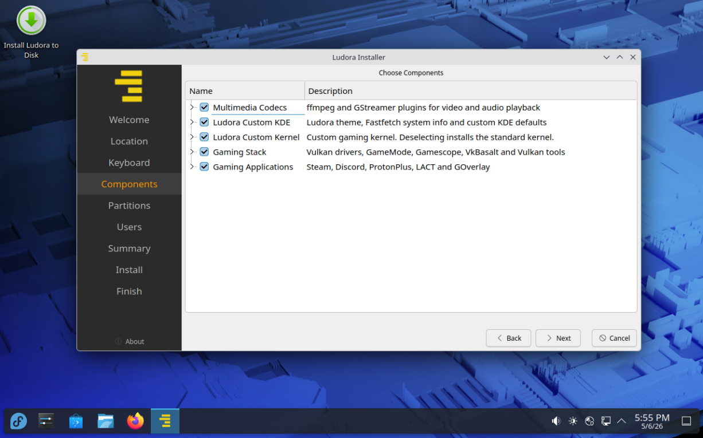
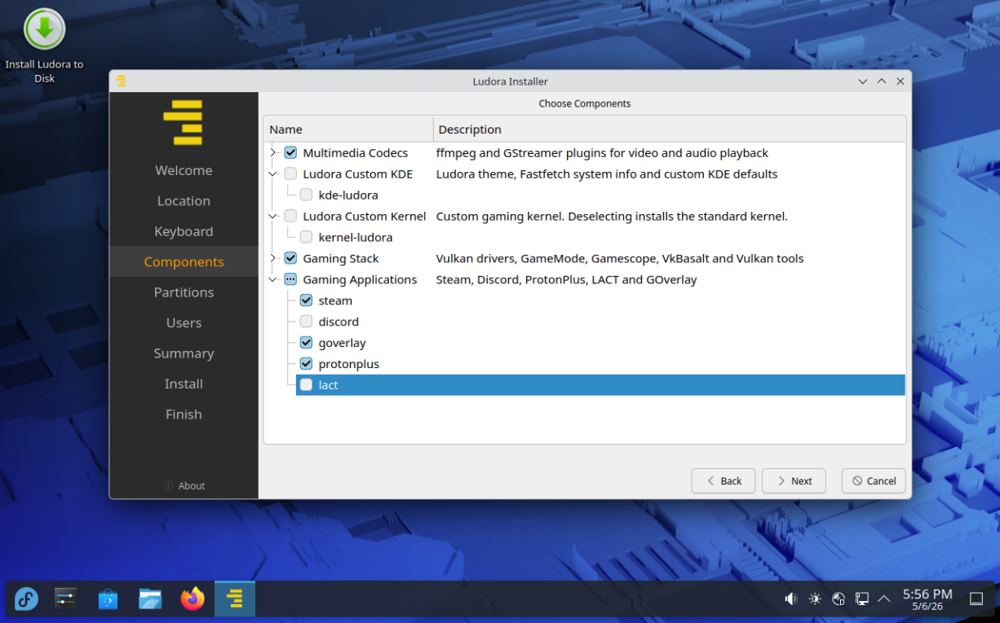

# Ludora

**Fedora with openSUSE-style bootable snapshots — not just for gamers**

Ludora (*"Ludo"* - Latin: "I am playing" + *"dora"* from Fedora) is a Fedora-based distribution that automatically sets up bootable Btrfs snapshots during installation. The installer lets you pick exactly what gets installed: go full gaming setup, or strip out all the gaming components for a clean Fedora 44 KDE with automatic rollback.

Break your system with a bad update? Just reboot, pick a snapshot from GRUB, and restore with one click.


---

## Why Bootable Snapshots Matter

Setting up openSUSE-style bootable snapshots on Fedora manually is complex:
- The default Anaconda installer doesn't support the required Btrfs subvolume layout
- Requires manual configuration of snapper, grub-btrfs, and DNF plugins
- Easy to misconfigure and end up with non-bootable snapshots

**Ludora handles all of this automatically** using a custom Calamares installer configuration. You get:

**Automatic snapshots** before and after every package update  
**Bootable from GRUB** - every snapshot appears in your boot menu  
**One-click rollback** - popup dialog when booting into snapshots  
**Hard to break** - always one reboot away from a working system  


---

## Choose Your Components

The installer presents five component groups, all selected by default. Deselect any of them — Ludora removes them from the final system.

| Component | What it includes | Default |
|---|---|---|
| **Multimedia Codecs** | ffmpeg and GStreamer plugins for video and audio | ✓ On |
| **Ludora Custom KDE** | Ludora theme, Fastfetch, custom KDE defaults | ✓ On |
| **Ludora Custom Kernel** | Gaming kernel with BORE scheduler and CachyOS patches | ✓ On |
| **Gaming Stack** | Vulkan drivers, GameMode, Gamescope, VkBasalt | ✓ On |
| **Gaming Applications** | Steam, Discord, ProtonPlus, LACT, GOverlay | ✓ On |




---

## Technical Details

**Snapshot Implementation:**
- **grub-btrfs** - Generates GRUB menu entries for snapshots
- **snapper** - Creates and manages Btrfs snapshots
- **libdnf5-plugin-snapper** - Automatic snapshots on package operations
- **Custom Calamares config** - Sets up proper subvolume layout during installation

**Base System:**
- Built on **Fedora 44** stable release
- **KDE Plasma** desktop environment
- Access to Fedora's extensive package repositories
- Regular security updates from upstream

---

## Download & Installation

### Download ISO
**[Download Ludora 44.2](https://sourceforge.net/projects/ludora/files/ludora44/Ludora44.2-x86_64.iso/download)**

Browse all files on **[SourceForge](https://sourceforge.net/projects/ludora/files/)** or check the [Releases](https://github.com/LarsSoeMikkelsen/Ludora/releases) page.

### Installation
1. Download the latest Ludora ISO
2. Create a bootable USB drive using:
   - **Fedora Media Writer** (recommended)
   - `dd` command on Linux
   - Rufus on Windows (use DD mode)
   - Etcher (cross-platform)
3. Boot from the USB drive
4. Install Ludora
5. **Important**: Select Btrfs filesystem during installation to enable snapshot functionality

### Post-Installation
Ludora is designed to work out of the box. After installation:
- Log in to KDE Plasma
- If you installed the Gaming Applications: launch Steam and start gaming
- If you skipped the gaming components: enjoy a clean Fedora 44 KDE desktop with automatic rollback

---

## COPR Repository

Ludora packages are maintained in a Fedora COPR repository:

**[https://copr.fedorainfracloud.org/coprs/predze/ludora](https://copr.fedorainfracloud.org/coprs/predze/ludora)**

The repository is automatically enabled on Ludora installations.

---

## Snapshot Management

### Automatic Snapshots
Snapshots are automatically created:
- **Before** DNF package operations (pre-snapshot)
- **After** DNF package operations (post-snapshot)

### Booting into Snapshots
1. Reboot your system
2. In the GRUB menu, select the snapshot you want to boot
3. The system boots into a read-only snapshot environment
4. Use the automatic rollback script to restore permanently if needed

### Manual Snapshot Management
```bash
# List all snapshots
sudo snapper list

# Create a manual snapshot
sudo snapper create --description "Before major changes"

# Delete a snapshot (by number)
sudo snapper delete <snapshot-number>
```

---

## Contributing

Contributions are welcome! Areas where you can help:
- Bug reports and testing
- Package improvements and optimizations
- Documentation improvements
- Theme and artwork enhancements

Please open issues for bugs or feature requests, and pull requests for improvements.

---

## Support & Community

- **Issues**: [GitHub Issues](https://github.com/LarsSoeMikkelsen/Ludora/issues)
- **Discussions**: [GitHub Discussions](https://github.com/LarsSoeMikkelsen/Ludora/discussions)

---

## License

Ludora consists of various open-source components, each with their own licenses:
- Fedora base system: Various open-source licenses
- Custom kernel patches: GPL-2.0
- Custom packages and scripts: GPL-3.0 (unless otherwise specified)

Specific license information for individual components can be found in their respective source repositories.

---

## Disclaimer

**Ludora is not affiliated with, endorsed by, or sponsored by the Fedora Project or Red Hat, Inc.**

Ludora is an independent derivative distribution based on Fedora. All trademarks belong to their respective owners.

---

## Acknowledgments

Ludora builds upon the work of many open-source projects:
- **Fedora Project** - Base distribution
- **CachyOS** - Kernel patches and optimizations
- **GloriousEggroll** - Proton-GE builds
