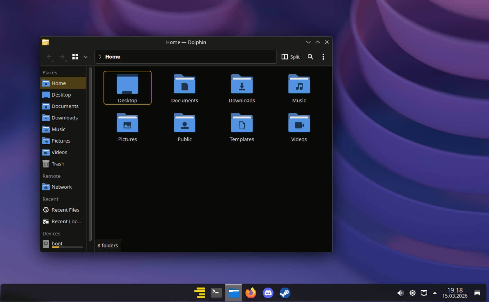
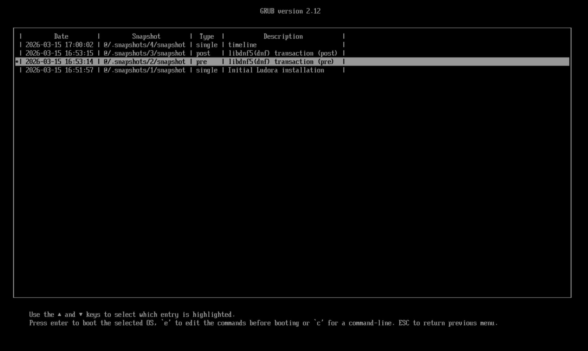
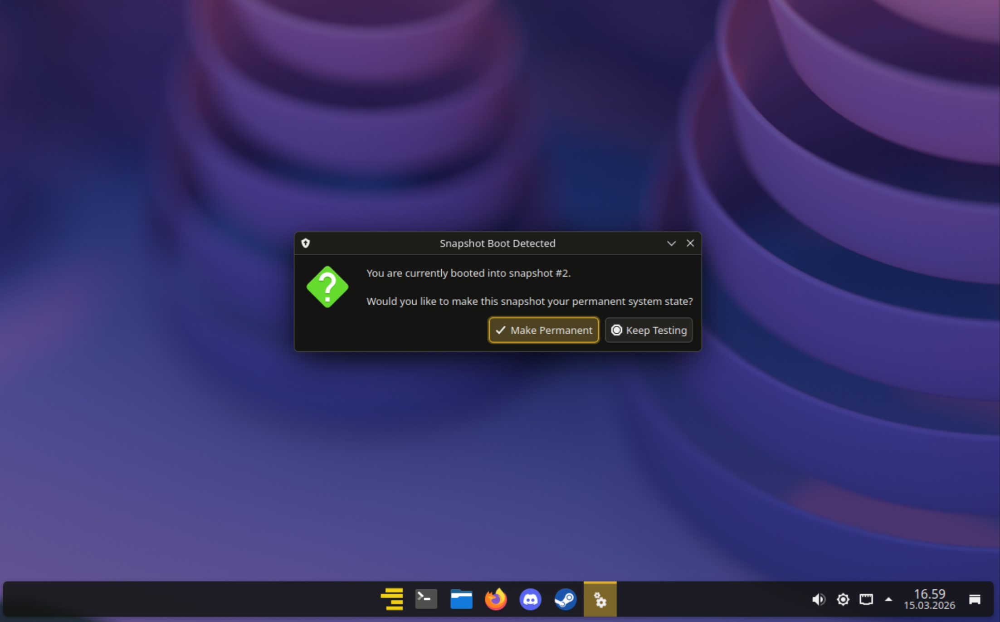

# Ludora

**A Fedora-based Linux distribution optimized for gaming and system stability**

> **Status**: Public Beta - Functional but expect rough edges

Ludora (*"Ludo"* - Latin: "I am playing" + *"dora"* from Fedora) is a gaming-focused Linux distribution built on Fedora 43, featuring a custom kernel with BORE scheduler, openSUSE-style bootable Btrfs snapshots, and a gaming-ready environment with zero configuration required.



---

## Features

### Custom Performance Kernel
- **BORE (Burst-Oriented Response Enhancer) scheduler** for improved gaming performance
- **CachyOS optimizations** and patches for enhanced responsiveness
- Optimized for low-latency gaming workloads

### Bootable Btrfs Snapshots
- **openSUSE-style snapshot system** integrated with GRUB bootloader
- **Automatic snapshots** before and after DNF package transactions
- **Automatic rollback script** for easy system recovery
- Boot directly into any snapshot from GRUB menu and restore it with ease





### Gaming-Ready Out of the Box
Pre-configured gaming stack with no additional setup required:
- Steam with Proton compatibility layer
- Proton-GE for enhanced game compatibility
- MangoHud for performance overlay
- GOverlay for MangoHud configuration
- ProtonPlus for Proton version management
- Fastfetch for system information

### KDE Plasma Desktop
- **Custom Ludora theme** with amber (#F2C12E) accents
- Polished, modern desktop environment
- Fully customizable to your preferences

### Fedora Stability
- Built on **Fedora 43** stable base
- Access to Fedora's extensive package repositories
- Regular security updates from upstream

---

## Download & Installation

### Download ISO
Ludora ISO images are hosted on SourceForge due to file size:

**[Download from SourceForge](https://sourceforge.net/projects/ludora/files/)**

Alternatively, check the [Releases](https://github.com/LarsSoeMikkelsen/Ludora/releases) page for the latest version and download links.

### Installation
1. Download the latest Ludora ISO
2. Create a bootable USB drive using:
   - **Fedora Media Writer** (recommended)
   - `dd` command on Linux
   - Rufus on Windows (use DD mode)
   - Etcher (cross-platform)
3. Boot from the USB drive
4. Follow the Anaconda installer prompts
5. **Important**: Select Btrfs filesystem during installation to enable snapshot functionality

### Post-Installation
Ludora is designed to work out of the box. After installation:
- Log in to KDE Plasma
- Launch Steam from the application menu
- Start gaming!

---

## COPR Repository

Ludora packages are maintained in a Fedora COPR repository:

**[https://copr.fedorainfracloud.org/coprs/predze/ludora](https://copr.fedorainfracloud.org/coprs/predze/ludora)**

The repository is automatically enabled on Ludora installations.

---

## Snapshot Management

### Automatic Snapshots
Snapshots are automatically created:
- **Before** DNF package operations (pre-snapshot)
- **After** DNF package operations (post-snapshot)

### Booting into Snapshots
1. Reboot your system
2. In the GRUB menu, select the snapshot you want to boot
3. The system boots into a read-only snapshot environment
4. Use the automatic rollback script to restore permanently if needed

### Manual Snapshot Management
```bash
# List all snapshots
sudo snapper list

# Create a manual snapshot
sudo snapper create --description "Before major changes"

# Delete a snapshot (by number)
sudo snapper delete <snapshot-number>
```

---

## Contributing

Ludora is in **public beta** and contributions are welcome! Areas where you can help:
- Bug reports and testing
- Package improvements and optimizations
- Documentation improvements
- Theme and artwork enhancements
- Build system automation

Please open issues for bugs or feature requests, and pull requests for improvements.

---

## Support & Community

- **Issues**: [GitHub Issues](https://github.com/LarsSoeMikkelsen/Ludora/issues)
- **Discussions**: [GitHub Discussions](https://github.com/LarsSoeMikkelsen/Ludora/discussions)

---

## License

Ludora consists of various open-source components, each with their own licenses:
- Fedora base system: Various open-source licenses
- Custom kernel patches: GPL-2.0
- Custom packages and scripts: GPL-3.0 (unless otherwise specified)

Specific license information for individual components can be found in their respective source repositories.

---

## Disclaimer

**Ludora is not affiliated with, endorsed by, or sponsored by the Fedora Project or Red Hat, Inc.**

Ludora is an independent derivative distribution based on Fedora. All trademarks belong to their respective owners.

---

## Acknowledgments

Ludora builds upon the work of many open-source projects:
- **Fedora Project** - Base distribution
- **CachyOS** - Kernel patches and optimizations
- **openSUSE** - Snapshot system inspiration
- **KDE Community** - Plasma desktop environment
- **Valve** - Steam and Proton
- **GloriousEggroll** - Proton-GE builds
